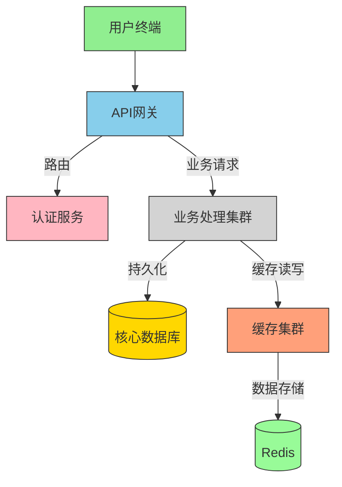
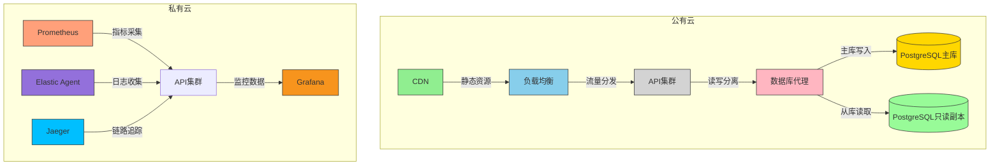

# FiveBear 系统架构文档

## 1. 系统概述

## 2. 技术栈
### 后端架构
| 组件         | 技术选型           | 版本   | 架构决策依据                  |
|--------------|--------------------|--------|------------------------------|
| 开发语言     | Java               | 17     | 企业级应用生态支持            |
| Web框架      | Spring Boot        | 3.2.0  | 微服务全家桶整合              |
| 数据库       | PostgreSQL         | 15     | 事务一致性与GIS支持           |
| 缓存         | Redis              | 7.0    | 分布式会话管理                |
| 消息队列     | Apache Kafka       | 3.5    | 事件驱动架构基础              |
| 配置中心     | Nacos              | 2.2.3  | 动态配置管理                  |
| 容器化       | Docker             | 24.0   | 环境一致性保障                |

### 架构演进记录

### 前端架构

## 3. 核心组件说明
### 认证服务架构

## 4. 部署架构

## 5. 数据流向

## 6. 监控体系
| 监控类型       | 工具               | 采集频率 |
|----------------|--------------------|----------|
| 应用性能       | Prometheus         | 15s      |
| 日志分析       | ELK Stack          | 实时     |
| 链路追踪       | Jaeger             | 按需     |
